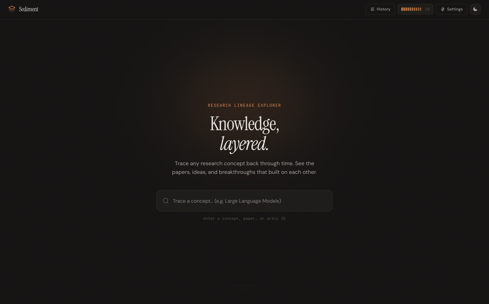

# Sediment



> Trace any research concept back through time. Knowledge, layered.

Sediment is an agent-powered research lineage explorer. Enter a concept or paper, and it traces the intellectual ancestry — surfacing the key papers, ideas, and breakthroughs that led to it, rendered as an interactive chronological timeline you can explore and expand.

## Stack

| Layer | Choice | Notes |
|---|---|---|
| Frontend | Next.js on Vercel | `frontend/` |
| Backend | FastAPI on Railway | `backend/` |
| Database | Supabase (hosted Postgres) | Tree state persistence |
| Graph Data | OpenAlex | Public paper graph: search, metadata, references |
| Agent | Claude | Seed selection, ranking, summaries, chat |
| Canvas | SVG in React | Hand-rolled, no React Flow |
| Export | Markdown serializer | Obsidian-ready |

## Repo Structure

```
sediment/
├── frontend/        # Next.js app (deployed to Vercel)
├── backend/         # FastAPI app (deployed to Railway)
└── README.md
```

## Features

- **Concept → Timeline** — backend fetches OpenAlex graph data, ranks lineage with Claude, renders left-to-right chronological map
- **Click to branch** — drill into any node, a new parallel lane expands in place
- **Obsidian export** — full tree as wikilinked markdown, frontmatter per paper
- **Shareable URLs** — no login, tree state persisted via Supabase short ID

## Environment Variables

### Frontend (`frontend/.env.local`)

| Variable | Required | Description |
|---|---|---|
| `NEXT_PUBLIC_API_URL` | No | Backend URL (defaults to `http://127.0.0.1:8000`) |
| `NEXT_PUBLIC_APP_VERSION` | No | App version string (defaults to `0.1.0`) |

### Backend (`backend/.env`)

| Variable | Required | Description |
|---|---|---|
| `ANTHROPIC_API_KEY` | Yes | Anthropic API key for Claude |
| `SUPABASE_URL` | Yes | Supabase project URL |
| `SUPABASE_SERVICE_ROLE_KEY` | Yes | Supabase service role key |
| `OPENALEX_API_KEY` | No | OpenAlex API key (polite pool, optional) |
| `OPENALEX_MAILTO` | No | Email for OpenAlex polite pool |
| `LLM_MODEL` | No | Claude model ID (defaults to `claude-haiku-4-5-20251001`) |

## Running Locally

### Frontend
```bash
cd frontend
npm install
npm run dev
```

### Backend
```bash
cd backend
python -m venv .venv
source .venv/bin/activate
pip install -r requirements.txt
uvicorn main:app --reload
```
