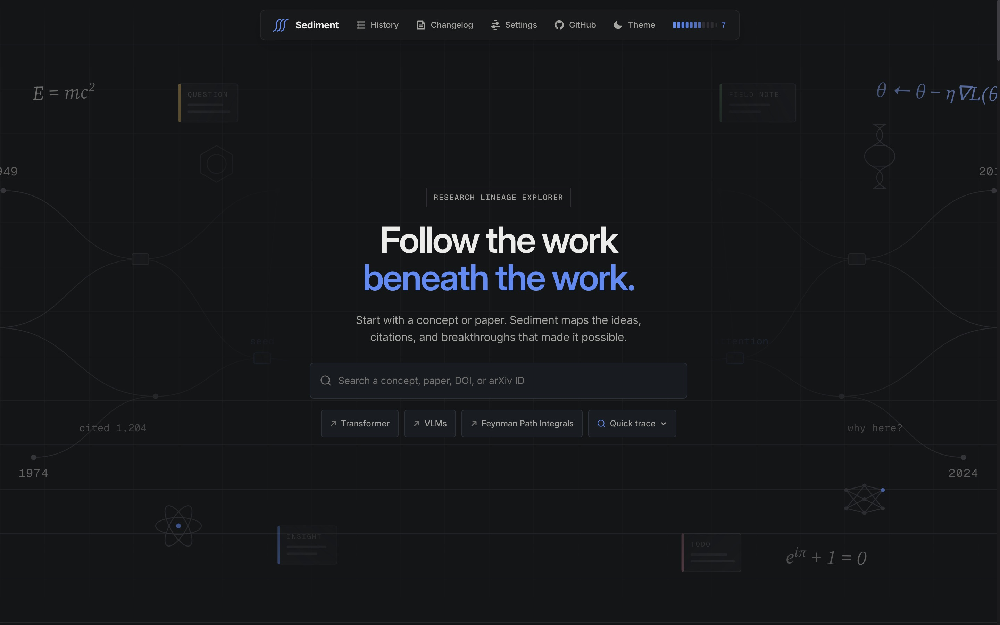
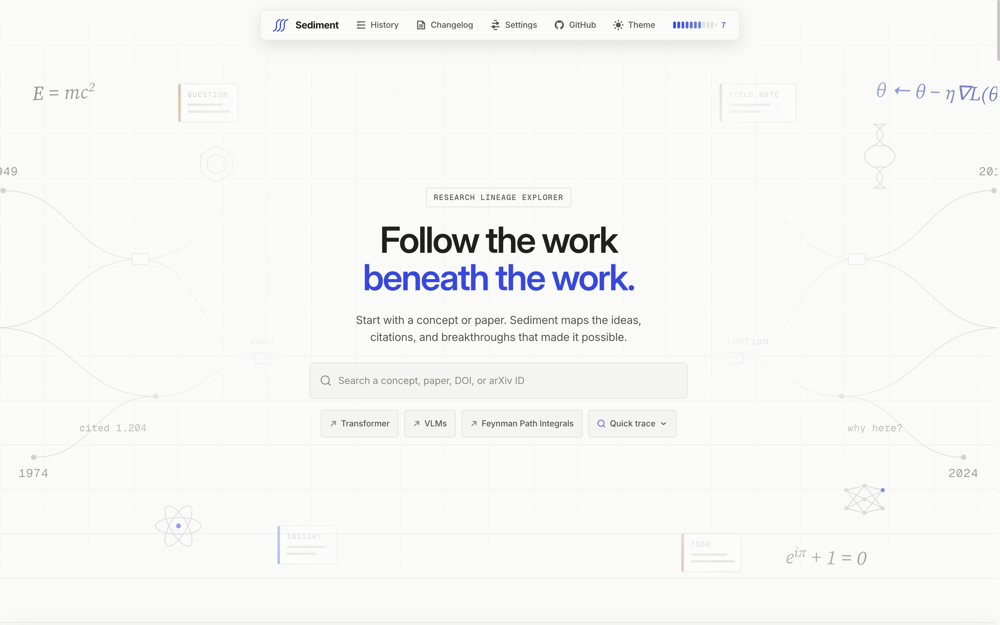
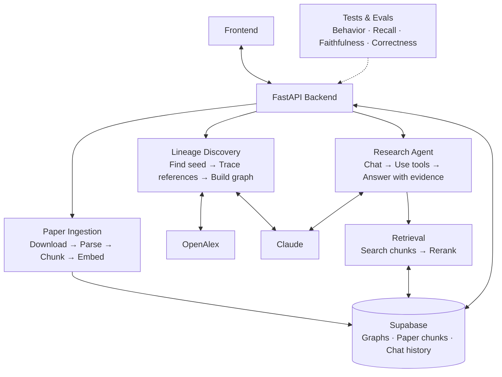
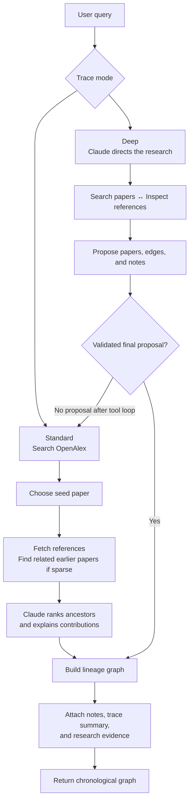
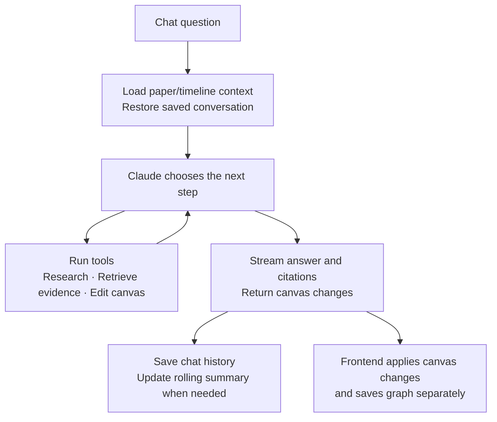
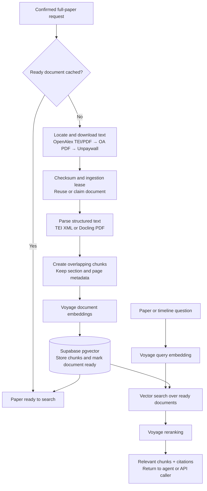
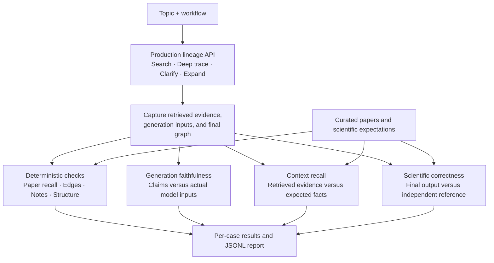

# Sediment

<table>
  <tr>
    <td align="center">
      <a href="https://www.sediment-ai.com/">
        
      </a>
      <br />
    </td>
    <td align="center">
      <a href="https://www.sediment-ai.com/">
        
      </a>
      <br />
    </td>
  </tr>
</table>

> Trace any research concept back through time. Knowledge, layered.

Sediment is an agentic research lineage explorer, built to be the 'cursor for academic research.' Enter any concept or paper, and sediment recursively compiles its intellectual ancestry: mapping the exact theoretical dependencies, seminal citations, and core breakthroughs that made it possible, rendered as an interactive, chronological graph you can deep-trace and expand.

## Stack

| Layer | Choice | Notes |
|---|---|---|
| Frontend | Next.js on Vercel | `frontend/` |
| Backend | FastAPI on Railway | `backend/` |
| Database | Supabase (hosted Postgres) | Tree state persistence |
| Graph Data | OpenAlex | Public paper graph: search, metadata, references |
| Agent | Claude | Seed selection, ranking, summaries, chat |
| Canvas | SVG in React | Hand-rolled, no React Flow |
| Export | Markdown serializer | Obsidian-ready |

## Architecture


```mermaid
flowchart TD
    UI["Frontend"] <--> API["FastAPI Backend"]

    API --> L["Lineage Discovery<br/>Find seed → Trace references → Build graph"]
    API --> A["Research Agent<br/>Chat → Use tools → Answer with evidence"]
    API --> P["Paper Ingestion<br/>Download → Parse → Chunk → Embed"]

    L <--> OA["OpenAlex"]
    L <--> C["Claude"]
    A <--> C

    A --> R["Retrieval<br/>Search chunks → Rerank"]
    P --> DB[("Supabase<br/>Graphs · Paper chunks · Chat history")]
    R <--> DB
    API <--> DB

    E["Tests & Evals<br/>Behavior · Recall · Faithfulness · Correctness"] -.-> API
```

### Lineage discovery

Lineage discovery turns a query into papers, relationships, and explanatory notes using OpenAlex metadata and references. It does not require downloading full papers.


```mermaid
flowchart TD
    Q["User query"] --> MODE{"Trace mode"}

    MODE --> S["Standard<br/>Search OpenAlex"]
    S --> SEED["Choose seed paper"]
    SEED --> REF["Fetch references<br/>Find related earlier papers if sparse"]
    REF --> RANK["Claude ranks ancestors<br/>and explains contributions"]
    RANK --> GRAPH["Build lineage graph"]

    MODE --> D["Deep<br/>Claude directs the research"]
    D --> TOOLS["Search papers ↔ Inspect references"]
    TOOLS --> PROPOSE["Propose papers, edges, and notes"]
    PROPOSE --> VALIDATE{"Validated final proposal?"}
    VALIDATE -->|Yes| GRAPH
    VALIDATE -->|No proposal after tool loop| S

    GRAPH --> NOTES["Attach notes, trace summary,<br/>and research evidence"]
    NOTES --> OUT["Return chronological graph"]
```

**Standard mode** follows a fixed pipeline:

1. Search paper titles and title/abstract text in parallel, merging title matches first. An empty result for a long, comma-separated query triggers a retry with its leading concept.
2. Use the user-selected seed, a clear title match, or Claude's choice among retrieved candidates. Low-confidence model selection returns candidates for disambiguation.
3. Fetch the seed's references. If fewer than three are available, search for related earlier papers; a successful fallback replaces the reference candidate set.
4. Ask Claude to rank ancestors and explain their contributions. Defaults are one reference level and five selected ancestors. Settings allow up to two levels, with a bounded number of ancestors explored further. Inferred fallback links are not traversed further.
5. Build edges pointing from ancestor to later paper, sort papers chronologically, and generate explanatory canvas notes. If note generation fails or yields no usable notes, a deterministic graph-based fallback can supply a note.

**Deep mode** gives Claude up to six model iterations and three tools:

| Tool | Purpose |
|---|---|
| `search_openalex_papers` | Search for candidates and missing foundational works. |
| `get_openalex_references` | Inspect references of a paper already retrieved during the trace. |
| `finish_deep_trace` | Submit the selected seed, papers, edges, and one to three connected notes. |

The final iteration forces a submission attempt. The backend requires at least one search and one reference lookup, accepts only retrieved papers, preserves an explicitly selected seed, and checks graph connectivity and note links. Direct reference evidence determines edge labels: verified links are `influenced`; unverified links become `inferred`, regardless of the model's proposed label. If the loop produces no validated final proposal, standard tracing runs as a fallback. A verified citation establishes a reference relationship, not proof of invention or causal dependence.

**Expansion** is a separate, single-paper operation: fetch that paper's references, rank them, and return the source plus selected ancestors. It does not run the deep agent or generate trace notes.

Implementation: [lineage orchestration](backend/app/services/lineage.py), [OpenAlex adapter](backend/app/services/openalex.py), and [prompts and agent loop](backend/app/services/llm.py).

### Research agent

The research agent answers questions about an individual paper or the whole timeline. Saved conversations restore recent messages and a rolling summary; paper chat also accepts a selected excerpt, while timeline chat accepts paper mentions and canvas context.


```mermaid
flowchart TD
    Q["Chat question"] --> CTX["Load paper/timeline context<br/>Restore saved conversation"]
    CTX --> C["Claude chooses the next step"]
    C --> T["Run tools<br/>Research · Retrieve evidence · Edit canvas"]
    T --> C
    C --> ANSWER["Stream answer and citations<br/>Return canvas changes"]
    ANSWER --> MEMORY["Save chat history<br/>Update rolling summary when needed"]
    ANSWER --> UI["Frontend applies canvas changes<br/>and saves graph separately"]
```

Each agent turn allows up to four tool-loop iterations, followed by a tool-disabled answer if the limit is reached. Independent read tools can run together; searches, ingestion, and canvas mutations stay ordered. Text, tool progress, citations, and completion events are streamed over SSE.

| Tool | Paper agent | Timeline agent | Purpose |
|---|:---:|:---:|---|
| `check_paper_access` | ✓ | ✓ | Check whether complete text is cached or retrievable. |
| `retrieve_paper_content` | ✓ | ✓ | Download and index complete text after user confirmation. |
| `search_paper_content` | ✓ | ✓ | Retrieve relevant cached chunks from one paper with citations. |
| `web_search` | ✓ | ✓ | Search public sources through Anthropic's hosted tool. |
| `retrieve_graph_context` | — | ✓ | Retrieve relevant papers, one-hop relationships, and connected notes without requiring full text. |
| `search_graph_paper_content` | — | ✓ | Search cached chunks across timeline papers. |
| `search_openalex_papers` | — | ✓ | Find candidates before adding papers to the lineage. |
| `update_lineage` | — | ✓ | Return paper additions, removals, and relationship changes. |
| `read_timeline_notes` | — | ✓ | Read notes by ID, color, kind, or text. |
| `create_timeline_notes` | — | ✓ | Create notes and connect them to timeline papers. |
| `update_timeline_notes` | — | ✓ | Edit, delete, connect, or disconnect notes. |
| `read_timeline_node_colors` | — | ✓ | Inspect persistent paper border colors. |
| `update_timeline_node_colors` | — | ✓ | Set or clear paper border colors. |

Paper tools are scoped to the active paper; timeline paper tools resolve against the current graph. Paper chat without a saved graph uses a simpler answer path without agent tools or persistent memory. Timeline chat can use several tools without persistence, but lineage edits and cached-text search require a saved graph context.

Prompts instruct the agent to make canvas changes only when requested and treat retrieved text and notes as untrusted evidence. The server separately checks full-paper confirmation, validates mutation targets, restricts additions to papers searched in the current turn, and protects the graph root from removal. Unlike deep-trace validation, timeline edits do not independently verify every proposed `influenced` edge against citation evidence.

Chat messages, tool records, and citations are persisted by the backend. Canvas changes are returned to the browser, applied there, and saved through a separate graph update. Private attachment notes are excluded from restored agent note context.

Implementation: [chat routes and tool handlers](backend/app/routers/chat.py), [agent prompts and tool definitions](backend/app/services/llm.py), [conversation memory](backend/app/services/chat_memory.py), and [graph context retrieval](backend/app/services/graph_retrieval.py).

### Paper ingestion and retrieval

Full-text ingestion is requested separately from lineage discovery. A ready cached document is reused; otherwise the backend locates an accessible source and indexes it for later questions.


```mermaid
flowchart TD
    REQ["Confirmed full-paper request"] --> CACHE{"Ready document cached?"}
    CACHE -->|Yes| READY["Paper ready to search"]
    CACHE -->|No| SOURCE["Locate and download text<br/>OpenAlex TEI/PDF → OA PDF → Unpaywall"]
    SOURCE --> LEASE["Checksum and ingestion lease<br/>Reuse or claim document"]
    LEASE --> PARSE["Parse structured text<br/>TEI XML or Docling PDF"]
    PARSE --> CHUNK["Create overlapping chunks<br/>Keep section and page metadata"]
    CHUNK --> EMBED["Voyage document embeddings"]
    EMBED --> DB[("Supabase pgvector<br/>Store chunks and mark document ready")]
    DB --> READY

    Q["Paper or timeline question"] --> QE["Voyage query embedding"]
    QE --> SEARCH["Vector search over ready documents"]
    DB --> SEARCH
    SEARCH --> RERANK["Voyage reranking"]
    RERANK --> EVIDENCE["Relevant chunks + citations<br/>Return to agent or API caller"]
```

Source downloads check HTTPS URLs, public DNS addresses, redirects, content signatures, and size limits. OpenAlex-hosted content requires its API key; Unpaywall uses the configured contact email. If no source can be downloaded, ingestion returns unavailable.

TEI parsing preserves available structure; PDF parsing uses Docling in a dedicated two-worker thread pool, with configured page and timeout limits. Chunking targets roughly 600 tokens with 80-token overlap and an 800-token grouping limit. Each embedding input includes the paper title and section. Voyage embeddings default to `voyage-4` with 1,024 dimensions.

Ingestion runs in the request's async workflow, with a database lease and heartbeat coordinating ownership. Its tracked states are `fetching → parsing → embedding → ready`; failures are recorded, and retries can reclaim expired leases. Downloading occurs before the checksum-based lease is acquired. Chunks are searchable only after the document is marked ready.

Retrieval embeds the question, selects up to 20 vector candidates by default, and reranks them with `rerank-2.5-lite` to return up to six context chunks. Graph searches are bounded to 25 paper IDs. A reranking provider error falls back to vector order. Citations identify the paper, document version, chunk, section, available pages, and source URL.

Uploaded private attachments use separate object storage; uploading a special note does not pass it through the paper embedding pipeline.

Implementation: [source access](backend/app/services/paper_access.py), [ingestion and parsing](backend/app/services/paper_ingestion.py), [retrieval](backend/app/services/paper_retrieval.py), [Voyage adapter](backend/app/services/voyage.py), and [database migrations](supabase/migrations).

### Tests and evaluations

Unit tests check backend behavior, while model evaluations measure the quality of generated lineage and explanations. The canonical evaluation covers lineage API workflows; it does not evaluate chat, document ingestion, database persistence, browser rendering, or deployment infrastructure.


```mermaid
flowchart TD
    CASE["Topic + workflow"] --> API["Production lineage API<br/>Search · Deep trace · Clarify · Expand"]
    API --> CAP["Capture retrieved evidence,<br/>generation inputs, and final graph"]
    CAP --> CHECK["Deterministic checks<br/>Paper recall · Edges · Notes · Structure"]
    CAP --> FAITH["Generation faithfulness<br/>Claims versus actual model inputs"]
    CAP --> RECALL["Context recall<br/>Retrieved evidence versus expected facts"]
    CAP --> CORRECT["Scientific correctness<br/>Final output versus independent reference"]
    GOLD["Curated papers and scientific expectations"] --> CHECK
    GOLD --> RECALL
    GOLD --> CORRECT
    CHECK --> REPORT["Per-case results and JSONL report"]
    FAITH --> REPORT
    RECALL --> REPORT
    CORRECT --> REPORT
```

| Suite | Scope | Execution |
|---|---|---|
| [Backend unit tests](backend/tests) | Parsing, chunking, retrieval, lineage validation, chat tools, memory, uploads, request limits, and accounting | Mocked dependencies; run in CI. |
| [Canonical API evals](backend/evaluation/e2e/README.md) | 30 cases: six AI/math topics × standard, deep, clarify/search, selected-seed deep, and expansion workflows | Real FastAPI app, live OpenAlex and Claude, with Ragas/Astra judging; usage persistence is mocked. Requires `RUN_E2E_EVALS=1`. |
| [Historical custom-judge evals](backend/evaluation/README.md) | Eight lineage and note cases using fixed bibliographic catalogs | Claude outputs judged against explicit criteria by Astra. Requires `RUN_LLM_EVALS=1`. |
| [Historical mathematics evals](backend/evaluation/ragas_math/README.md) | Six standard/deep cases for FISTA, ADMM, and compressed sensing | Ragas/Astra scoring against fixed reference evidence. Requires `RUN_RAGAS_EVALS=1`. |
| [Cached-paper retrieval evaluation](backend/scripts/evaluate_retrieval.py) | Compare vector-only and reranked results using expected phrases or sections; report hit rates, reciprocal rank, and citation coverage | Requires indexed papers, Supabase, and Voyage. Uses a separate [case file](backend/evaluation/retrieval_cases.example.json). |

The canonical suite keeps three evidence sets distinct: **faithfulness** uses the inputs actually supplied to each generation stage; **context recall** checks retrieved evidence against three expected facts per topic; **correctness** uses an independent scientific reference. Gold reference material is not injected into application prompts.

Passing requires every scored generation stage to reach 0.90 faithfulness, context recall of 1.0, required-paper recall of 1.0, verified-edge precision of 1.0 when applicable, and correctness of at least 4/5. Note foundation coverage is also required, except for expansion, which does not generate notes. Structural failures, hidden provider errors, and deep-to-standard fallback cannot count as passes.

An [offline harness](backend/evaluation/e2e/check_offline.py) runs all 30 API scenarios with synthetic provider responses and network access blocked, including failure controls and reporting checks. This validates evaluation wiring, not model quality. Paid suites are skipped by default, and their detailed READMEs document dependencies, commands, call limits, and result interpretation. The retrieval script requests ten results, but the retrieval service's default six-context limit still applies unless configured otherwise.

## Repo Structure

```
sediment/
├── frontend/        # Next.js app (deployed to Vercel)
├── backend/         # FastAPI app (deployed to Railway)
└── README.md
```

## Features

- **Concept → Timeline** — backend fetches OpenAlex graph data, ranks lineage with Claude, renders left-to-right chronological map
- **Click to branch** — drill into any node, a new parallel lane expands in place
- **Obsidian export** — full tree as wikilinked markdown, frontmatter per paper
- **Shareable URLs** — no login, tree state persisted via Supabase short ID
- **Anonymous usage cap** — backend enforces a daily spend limit and burst limit using hashed anonymous actor keys instead of storing raw caller IPs

## Security And Privacy Notes

- Sediment currently uses a server-derived anonymous actor key for usage limits on expensive API routes.
- That actor key is derived from the caller's IP address using a server-only HMAC secret.
- The usage limiter stores the derived actor key, not the raw IP address, for daily budget and burst-limit enforcement.
- This is intended for abuse prevention and cost control, not account-level identity or behavioral profiling.

## Environment Variables

### Frontend (`frontend/.env.local`)

| Variable | Required | Description |
|---|---|---|
| `NEXT_PUBLIC_API_URL` | No | Backend URL (defaults to `http://127.0.0.1:8000`) |
| `NEXT_PUBLIC_USE_API_PROXY` | No | Set to `true` to route expensive API calls through Next.js server-side proxy handlers instead of calling the backend directly |
| `NEXT_PUBLIC_APP_VERSION` | No | App version string (defaults to `0.1.0`) |

When `NEXT_PUBLIC_USE_API_PROXY=true`, configure one of these server-only frontend env vars for the proxy target:

- `BACKEND_INTERNAL_URL`
- `RAILWAY_API_URL`

### Backend (`backend/.env`)

| Variable | Required | Description |
|---|---|---|
| `ANTHROPIC_API_KEY` | Yes | Anthropic API key for Claude |
| `SUPABASE_URL` | Yes | Supabase project URL |
| `SUPABASE_SERVICE_ROLE_KEY` | Yes | Supabase service role key |
| `ACTOR_KEY_SECRET` | Yes | Server-only secret used to HMAC-hash caller IPs into anonymous usage buckets for rate limiting and daily spend caps |
| `TRUST_RAILWAY_PROXY_HEADERS` | No | Set to `true` on Railway so the backend uses Railway-provided client IP headers instead of the proxy peer IP |
| `TRUSTED_PROXY_CIDRS` | No | Comma-separated proxy CIDRs allowed to supply trusted client IP headers. Defaults to `100.0.0.0/8` for Railway-style proxy networks |
| `OPENALEX_API_KEY` | No | OpenAlex API key (polite pool, optional) |
| `OPENALEX_MAILTO` | No | Email for OpenAlex polite pool |
| `LLM_MODEL` | No | Claude model ID (defaults to `claude-haiku-4-5-20251001`) |

## Running Locally

### Frontend
```bash
cd frontend
npm install
npm run dev
```

### Backend
```bash
cd backend
python -m venv .venv
source .venv/bin/activate
pip install -r requirements.txt
uvicorn main:app --reload
```

Generate `ACTOR_KEY_SECRET` once and keep it stable across restarts and deployments:

```bash
openssl rand -hex 32
```

## LLM evaluations

The canonical backend suite is the [30-case API evaluation](backend/evaluation/e2e/README.md),
covering lineage faithfulness, recall, and scientific correctness across AI and
mathematics topics. Paid cases require `RUN_E2E_EVALS=1`.

The historical [eight-case custom-judge suite](backend/evaluation/README.md) uses
OpenAI Astra to judge Claude's lineage graphs, paper summaries, and canvas notes
against curated reference evidence. Its paid cases require `RUN_LLM_EVALS=1`.

A separate [Ragas mathematics suite](backend/evaluation/ragas_math/README.md)
adds six standard/deep lineage cases for FISTA, ADMM, and compressed sensing.
It uses its own environment and `RUN_RAGAS_EVALS=1` opt-in flag.
