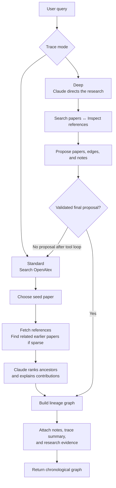
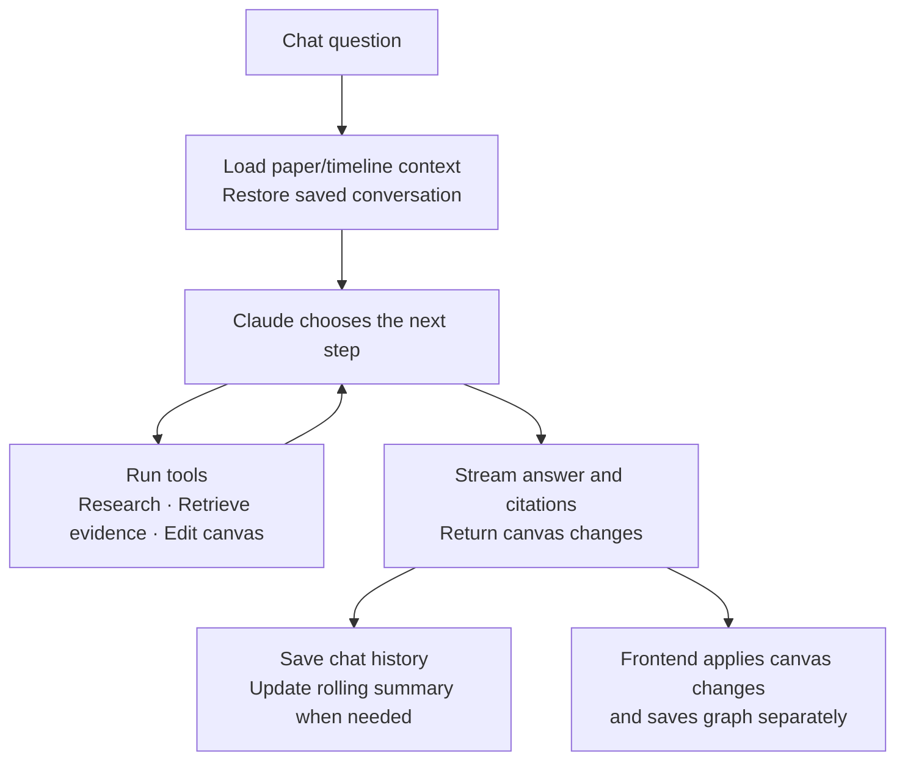
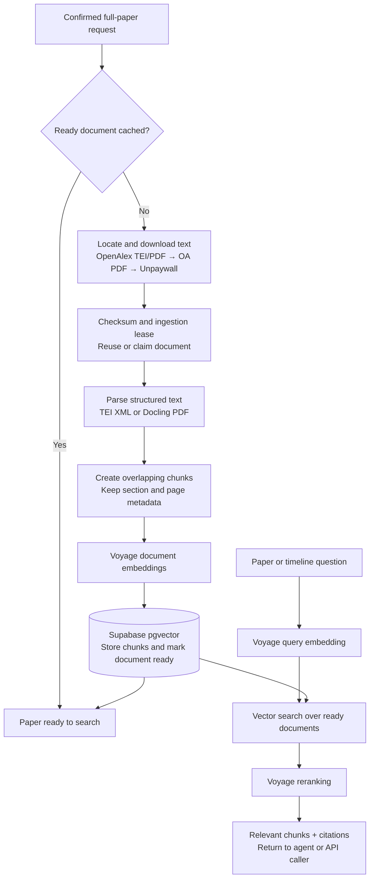
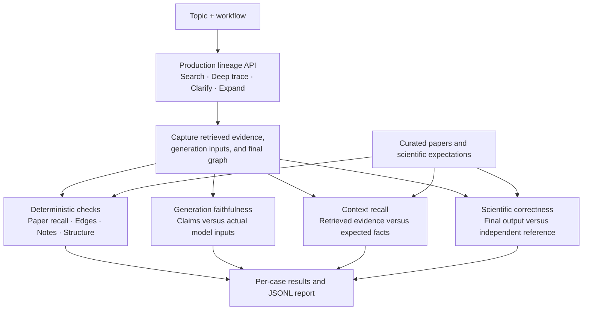

# Architecture diagrams

Detailed subsystem flows for Sediment. See the [main architecture overview](../README.md#architecture) for how these components fit together.

## Lineage discovery

Lineage discovery turns a query into papers, relationships, and explanatory notes using OpenAlex metadata and references. It does not require downloading full papers.

## Research agent

The research agent answers questions about an individual paper or the whole timeline. Saved conversations restore recent messages and a rolling summary; paper chat also accepts a selected excerpt, while timeline chat accepts paper mentions and canvas context.

## Paper ingestion and retrieval

Full-text ingestion is requested separately from lineage discovery. A ready cached document is reused; otherwise the backend locates an accessible source and indexes it for later questions.

## Tests and evaluations

Unit tests check backend behavior, while model evaluations measure the quality of generated lineage and explanations. The canonical evaluation covers lineage API workflows; it does not evaluate chat, document ingestion, database persistence, browser rendering, or deployment infrastructure.

